# Digital Communication Laboratory Codes

This repository contains simulations related to basic digital communication methods and principles. Each folder represents a specific session. Below is a list of sessions along with a brief description of their contents.

## Sessions Overview

1. [PreLab01](#prelab01)
2. [PreLab02](#prelab02)
3. [PreLab03](#prelab03)
4. [Lab01](#lab01)
5. [Lab02](#lab02)
6. [Lab03](#lab03)
7. [Lab04](#lab04)
8. [Lab05](#lab05)
9. [Lab06](#lab06)

---

## PreLab01

- **Topics**:
    - Working with basic pulse shapes and analyzing their characteristics.
    - Deriving PSK modulation bit error rate (BER) formula and plotting it versus SNR, comparing it with MATLAB’s `berawgn` function.
    - Examining the effects of channel magnitude ($\alpha$) and phase ($\phi$) on the Symbol Error Rate (SER) of PSK modulation.

<div style="display: flex; justify-content: space-between;">
  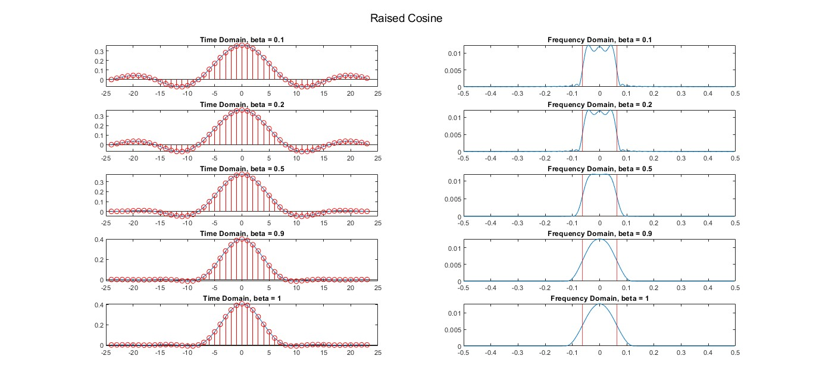
  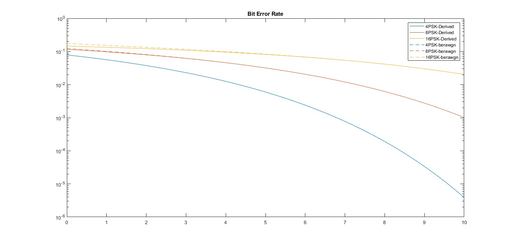
</div>

---

## PreLab02

- **Topics**:
    - Implementing a method to achieve a Gaussian distribution using the Central Limit Theorem (CLT).
    - Implementing digital filtering and comparing results with MATLAB’s built-in `filter` function.
    - Determining the start of data transmission using correlation and a predefined header.
    - Visualizing the FFT of a single-tone signal and analyzing how various parameters (e.g., sample size, input frequency) affect the FFT output.

<div style="display: flex; justify-content: space-between;">
  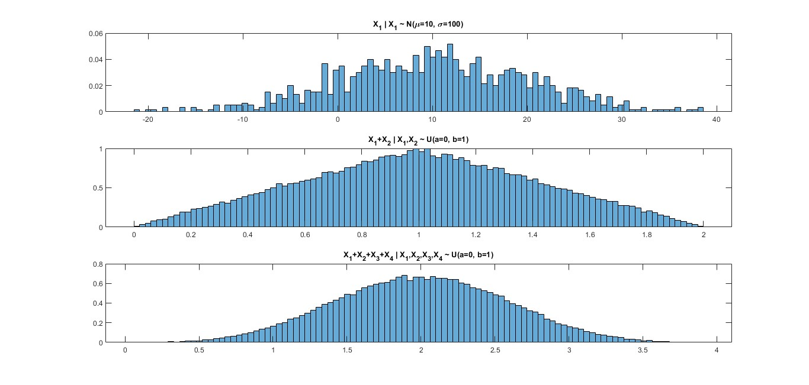
  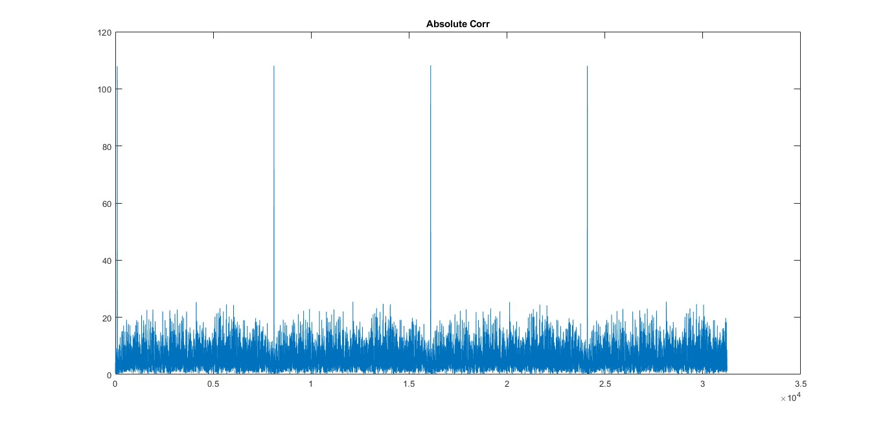
</div>

---

## PreLab03

- **Topics**:
    - Using matrices to calculate the Discrete Fourier Transform (DFT) and signal spectrum.
    - Observing the impact of non-ideal transformations from intermediate-band to baseband.

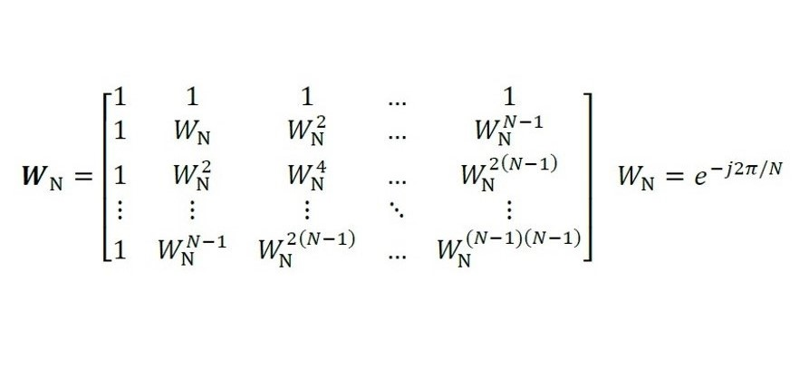
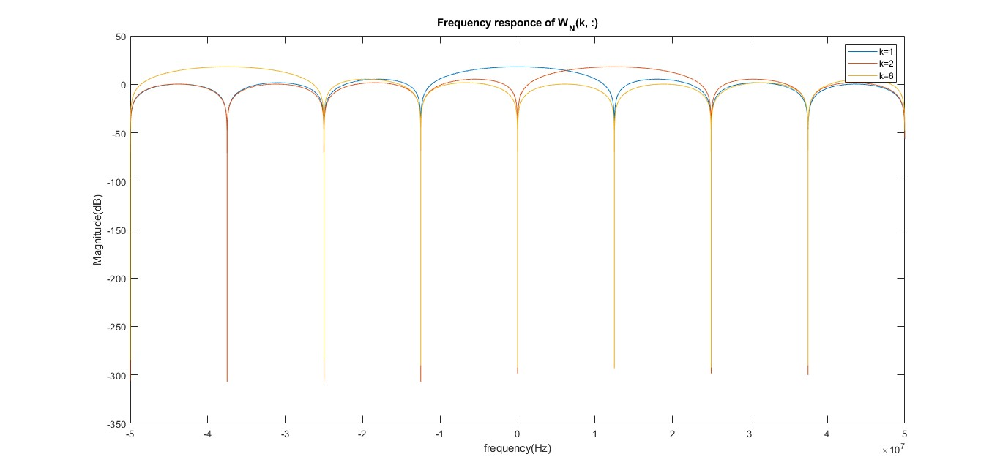

---

## Lab01

- **Topics**:
    - Simulations related to white noise, filtering, baseband signals, and intermediate-band signals.

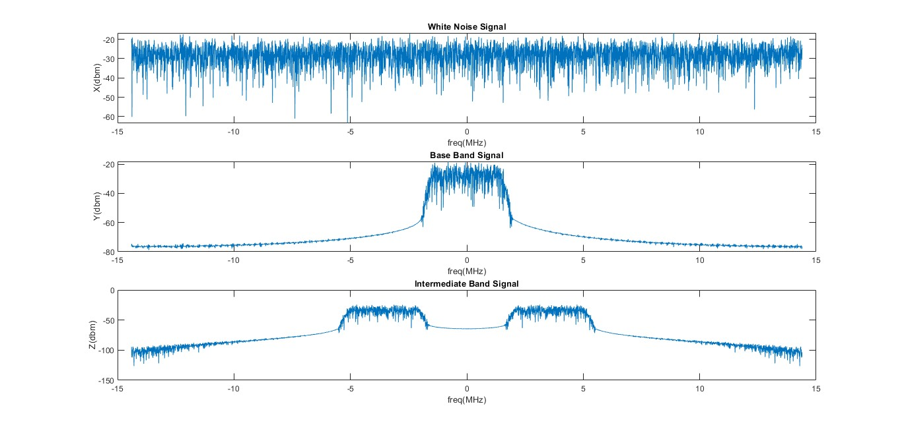

---

## Lab02

- **Topics**:
    - Implementing a transmission simulation. The goal is to send data packets through an ideal channel and detect them.

- **Main functions**:
    - `bitGenerator`: Generates bits for transmission.
    - `grayMatrixGenerator`: Generates Gray code matrix for encoding.
    - `pulseModulation`: Modulates bits with different pulse shapes (e.g., triangular).
    - `symbolDetection`: Detects symbols using correlators or matched filters.
    - `minDistanceDetector`: Detects symbols based on minimum distance.

- **Modulation schemes**:
    - PAM
    - PSK
    - QAM

***Note:*** FSK modulation (coherent and non-coherent) is implemented in `lab05.m`.

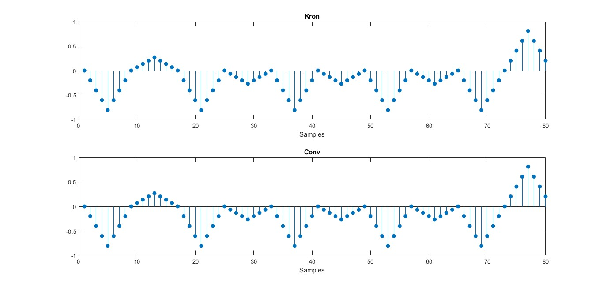

---

## Lab03

- **Topics**:
    - A complete implementation of a communication system, transmitting data with added noise, time delay, and phase offset.
    - Bit Error Rate (BER) vs SNR curves were plotted and compared with MATLAB’s built-in functions.

<div style="display: flex; justify-content: space-between;">
  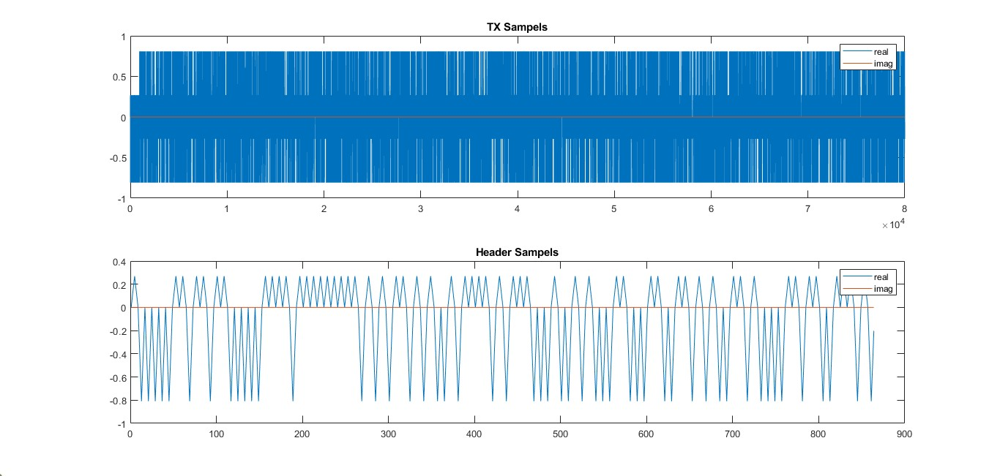
  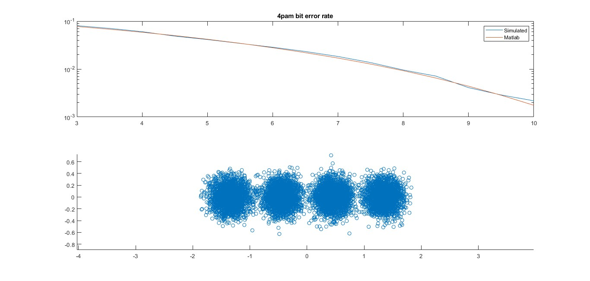
</div>

---

## Lab04

- **Topics**:
    - Implementing a simple example to get started with the **ADALM-PLUTO (PlutoSDR)**.
    - Transmitting and receiving data using the PlutoSDR, visualized with MATLAB plots.

- **Files**:
    - `example.m`: A basic code for initializing and working with PlutoSDR.
    - `lab04.m`: Implements the communication system from `lab03.m` on PlutoSDR.

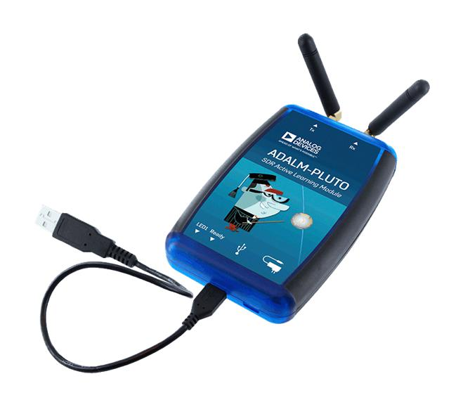

---

## Lab05

- **Topics**:
    - Completion of `lab03.m` with added Frequency Shift Keying (FSK) modulation and simulation.

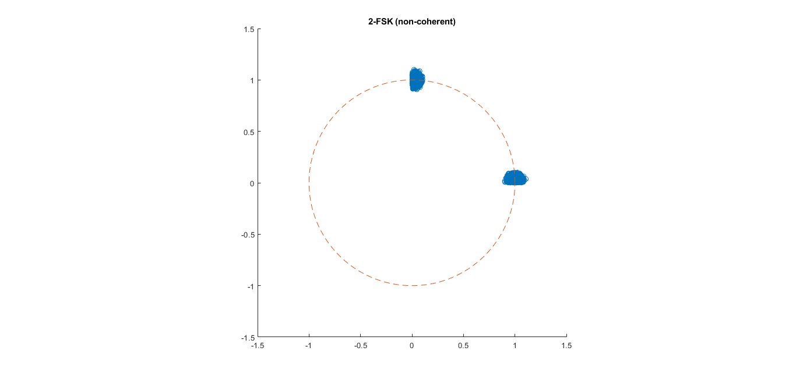

---

## Lab06

- **Topics**:
    - Hardware implementation of `lab05.m` using **ADALM-PLUTO (PlutoSDR)**. It builds upon `lab04.m` with updates for FSK modulation.

---

### How to Use

1. Clone the repository:
    ```bash
    git clone https://github.com/your-username/digital-communication-lab.git
    cd digital-communication-lab
    ```

2. Open MATLAB and navigate to the desired session folder (e.g., `PreLab01`, `Lab01`, etc.).

3. Run the MATLAB scripts from the command line or MATLAB editor.


